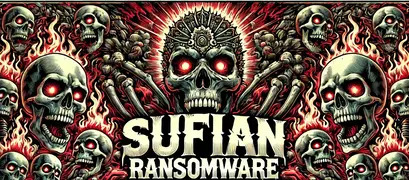

# Sufian Ransomware

  

## Table of Contents

1. [Introduction](#introduction)
2. [Features](#features)
3. [Installation](#installation)
4. [Usage](#usage)
5. [Script Overview](#script-overview)
6. [Detailed Function Descriptions](#detailed-function-descriptions)
7. [Demo Video](#demo-video)
8. [Disclaimer](#disclaimer)

---

## Introduction

The **Sufian Ransomware** is a simulated ransomware tool developed for educational purposes. It is designed to encrypt files on the victim's machine, display a ransom note, and provide a decryption mechanism upon receiving a valid Bitcoin transaction number. 

> **Note:** This tool is intended strictly for educational use. Please do not deploy it on any system you do not have explicit permission to test.

## Features

- **File Encryption**: Encrypts specific files on the user's desktop.
- **Custom Ransom Note**: Displays a customized ransom note using a graphical user interface (GUI).
- **Timer Countdown**: Includes a countdown timer showing the remaining time to pay the ransom.
- **Background Change**: Changes the desktop background to a predefined image.
- **Decryption Process**: Files can be decrypted upon verification of the payment.
- **Network Discovery**: Automatically discovers the backend server via UDP broadcast.

## Installation

### Prerequisites

- Python 3.x
- Required Python packages (can be installed via `requirements.txt`):
  - `customtkinter`
  - `PIL` (Pillow)
  - `requests`
  - `pycryptodome`
  - `psutil`
  - `windows-tools`

### Step-by-Step Installation
*These are not complete instructions and I will not be providing them for safety reasons including the networking*

1. **Clone the Repository**:
    ```bash
    git clone https://github.com/sufianadnan/Ransomware.git
    cd Ransomware
    ```
2. **On the attacker machine 2 terminals. Make sure to have the backend folder.**
    ```
    python udpbroadcast.py
    python backend.py
    ```
3. **Pack the exe. (I did not provide this, it will be to easy then)
4. Deploy on victim machine.

## Usage

Upon running the script, the following sequence of events occurs:

1. The script discovers the backend server using a UDP broadcast.
2. The main GUI window appears, displaying the ransom note and countdown timer.
3. The script encrypts specific files on the user's desktop.
4. The user can input their Bitcoin transaction number into the provided field.
5. If the payment is verified, the files are decrypted and the desktop background is reverted.

### Command Line Arguments

- **`--help`**: Display the help message with all available options.

## Script Overview

This script is a comprehensive ransomware simulation, consisting of several key components:

- **GUI**: Created using `customtkinter`, it provides a user-friendly interface for the ransom note and countdown timer.
- **File Encryption/Decryption**: Utilizes AES and RSA encryption algorithms to securely encrypt and decrypt files.
- **Network Communication**: Employs `requests` for HTTP communication with the backend server.
- **System Information Collection**: Gathers system information for the backend using various Python libraries.

## File Structure

```bash
Sufian-Ransomware/
│
├── images/                 # Directory containing images like background, banner, etc.
│   ├── background.jpg
│   ├── banner2.jpg
│   ├── app.ico
│   └── qr.png
│
├── files/                  # Directory containing PowerShell scripts and other support files.
│   ├── Invoke-DCSync.ps1
│   ├── Invoke-Mimikatz.ps1
│   ├── PowerView.ps1
│   ├── ADRecon.ps1
│   └── Updated-Invoke-DCSync.ps1
│
├── main.py                 # Main script file.
├── README.md               # This README file.
```
## Detailed Function Descriptions

### `discover_backend()`
Discovers the backend server's IP address using a UDP broadcast. The function sends a broadcast message and listens for a response to identify the backend server.

### `collect_system_info()`
Gathers detailed system information including CPU, GPU, RAM, HWID, and other relevant data. This information is then sent to the backend server.

### `encrypt_data(data)`
Encrypts the given data using AES encryption in CBC mode. The function returns a base64 encoded string of the IV concatenated with the ciphertext.

### `decrypt_data(data)`
Decrypts AES-encrypted data. It first extracts the IV, then decrypts the ciphertext and returns the plaintext.

### `get_hashes(computer_id)`
Runs PowerShell scripts to collect hashes and other security-related data from the system, which are then sent to the backend server.

### `encrypt_files_on_desktop(computer_id)`
Encrypts all `.txt` files on the user's desktop using AES encryption. The AES keys are encrypted with an RSA public key and stored securely.

### `change_desktop_background(image_path)`
Changes the user's desktop background to the specified image file.

### `App` Class
The `App` class represents the main GUI application. It manages the layout, event handling, and the core logic of the ransomware simulation.

## Demo Video

### Watch the Demo

[](https://youtu.be/uM76phiD_2Q)  

## Disclaimer

This tool is developed for educational purposes only. The author does not condone the use of this tool for malicious purposes. Use this tool responsibly and only on systems you own or have explicit permission to test.
